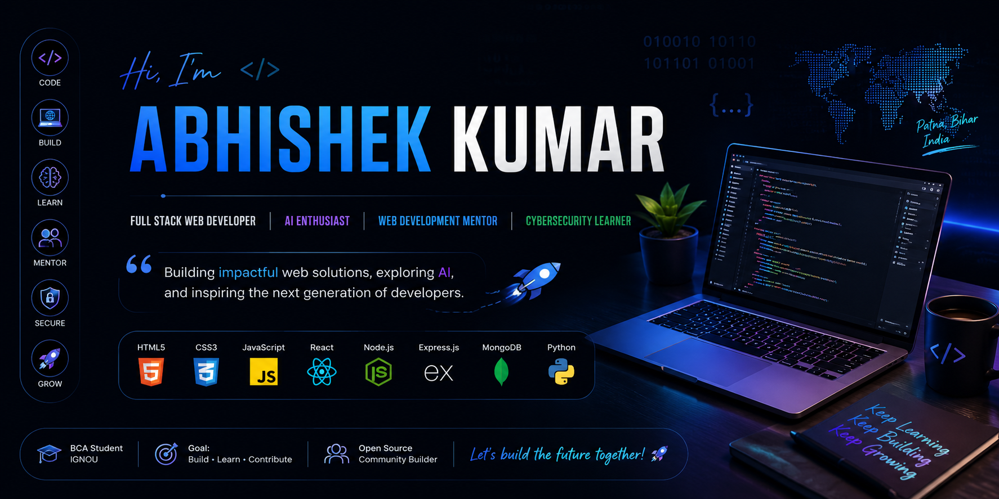

  

## 📊 GitHub Stats

Hi 👋, I'm Abhishek Kumar
Full Stack Web Developer | Web Development Mentor | Cybersecurity Enthusiast | AI Explorer

"Building projects that solve real problems while continuously learning and helping others grow."

I'm currently pursuing Bachelor of Computer Applications (BCA) from IGNOU.

I enjoy building full-stack web applications, learning modern technologies, mentoring students, and exploring AI.

During my journey, I had the opportunity to mentor students in a Web Development & Cybersecurity Internship Program, where I guided beginners through web development fundamentals and introduced cybersecurity concepts.

Apart from coding, I enjoy networking with developers, attending tech events, and contributing to the developer community.

Currently Learning
Advanced Backend
AI & Machine Learning
System Design
Cloud Computing
DevOps
